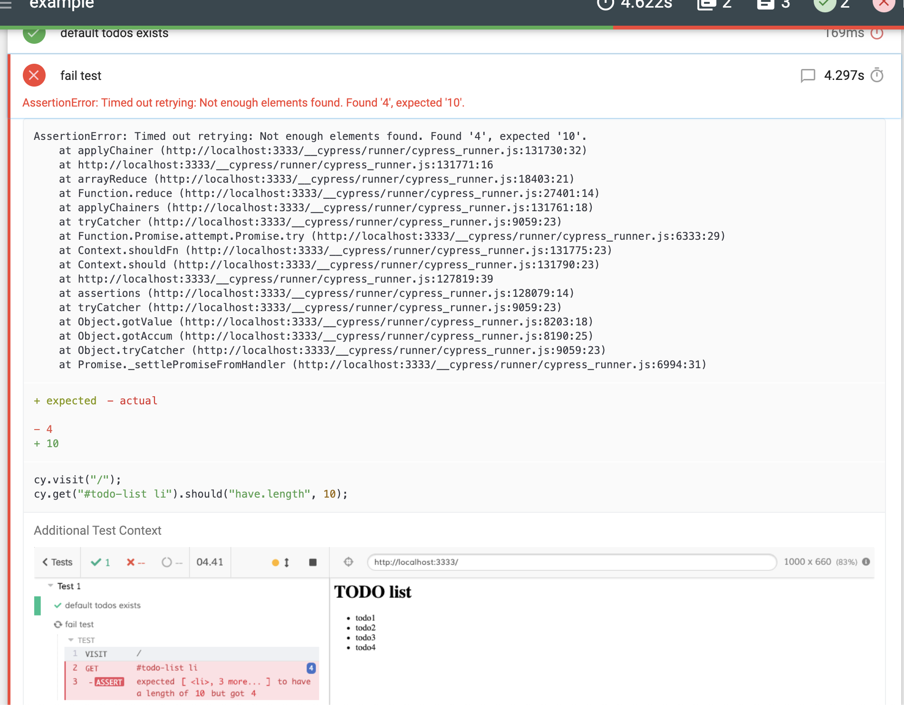

# cypress-mochawesome-reporter

[](http://www.npmjs.com/package/cypress-mochawesome-reporter)
[](https://github.com/LironEr/cypress-mochawesome-reporter)
[](http://www.npmjs.com/package/cypress-mochawesome-reporter)
[](http://www.npmjs.com/package/cypress-mochawesome-reporter)

Zero config Mochawesome reporter for Cypress with screenshots attached to tests.

[Example report](https://lironer.github.io/cypress-mochawesome-reporter/example-report/mochawesome.html)



## Cypress compatibility

| reporter version | cypress version                                                               | reporter branch                                                         |
| ---------------- | ----------------------------------------------------------------------------- | ----------------------------------------------------------------------- |
| `v3`             | node >= 14<br/>>= `6.7.0` <br />>= `6.2.0` with `experimentalRunEvents: true` | `master`                                                                |
| `v2`             | >= `6.7.0` <br />>= `6.2.0` with `experimentalRunEvents: true`                | [`v2`](https://github.com/LironEr/cypress-mochawesome-reporter/tree/v2) |
| `v1`             | >= `4.0.0`                                                                    | [`v1`](https://github.com/LironEr/cypress-mochawesome-reporter/tree/v1) |

[migration guide from `v1` to `v2`](./migration.md)

## Setup

> This setup tutorial works with Cypress >= v10, looking for older version setup? [here](https://github.com/LironEr/cypress-mochawesome-reporter/blob/9c11e7005351e8750fe48b90d010c9bf29539956/README.md#setup)

1. install cypress-mochawesome-reporter

    ```
    npm i --save-dev cypress-mochawesome-reporter
    ```

    or

    ```
    yarn add -D cypress-mochawesome-reporter
    ```

2. Change cypress reporter & setup hooks

    Edit config file (`cypress.config.js` by default)

    ```js
    const { defineConfig } = require('cypress');

    module.exports = defineConfig({
      reporter: 'cypress-mochawesome-reporter',
      e2e: {
        setupNodeEvents(on, config) {
          require('cypress-mochawesome-reporter/plugin')(on);
        },
      },
    });
    ```

    If you are override `before:run` or `after:run` hooks, use this:

    ```js
    const { defineConfig } = require('cypress');
    const { beforeRunHook, afterRunHook } = require('cypress-mochawesome-reporter/lib');

    module.exports = defineConfig({
      reporter: 'cypress-mochawesome-reporter',
      e2e: {
        setupNodeEvents(on, config) {
          on('before:run', async (details) => {
            console.log('override before:run');
            await beforeRunHook(details);
          });

          on('after:run', async () => {
            console.log('override after:run');
            await afterRunHook();
          });
        },
      },
    });
    ```

3. Add to `cypress/support/e2e.js`

    ```javascript
    import 'cypress-mochawesome-reporter/register';
    ```

5. run cypress

## Custom options

If you want to customize your HTML report with [mochawesome-report-generator flags](https://github.com/adamgruber/mochawesome-report-generator#cli-flags) just add the flags you want to `reporterOptions`

```js
const { defineConfig } = require('cypress');

module.exports = defineConfig({
  reporter: 'cypress-mochawesome-reporter',
  reporterOptions: {
    charts: true,
    reportPageTitle: 'custom-title',
    embeddedScreenshots: true,
    inlineAssets: true,
    saveAllAttempts: false,
  },
  e2e: {
    setupNodeEvents(on, config) {
      require('cypress-mochawesome-reporter/plugin')(on);
    },
  },
});
```

Additional reporter options:

| name                  | type      | default | description                                                                                                        |
| --------------------- | --------- | ------- | ------------------------------------------------------------------------------------------------------------------ |
| `embeddedScreenshots` | `boolean` | `false` | Embedded external screenshots into HTML using base64, use with `inlineAssets` option to produce a single HTML file |
| `quiet`               | `boolean` | `false` | Silence console messages                                                                                           |
| `saveAllAttempts`     | `boolean` | `true`  | Save screenshots of all test attempts, set to `false` to save only the last attempt                                |
| `debug`               | `boolean` | `false` | Creates log file with debug data                                                                                   |

## Examples

1. [Simple use of `cypress-mochawesome-reporter`](examples/simple)
2. [Using `cypress-multi-reporters`](examples/multiple-reporters)
3. [With `mochawesome-report-generator` flags](examples/mochawesome-flags)
4. [Change default screenshots folder in `cypress.json`](examples/screenshots-folder)

Run `npm i` in root directory then:

```
cd examples/<example-project>

npm i
npm test
```
